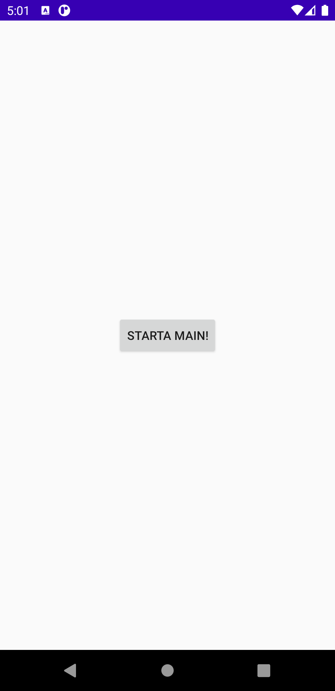
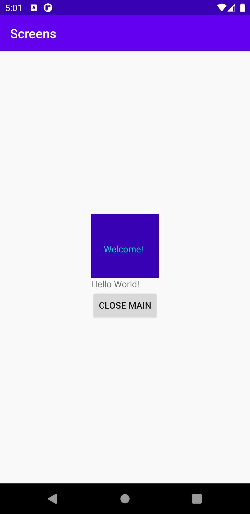

# Rapport Screens

Till denna uppgift gavs uppdraget att skapa en applikation med en andra aktivitet. En första aktivitet skulle också finnas, och denna dkulle innehålla en knapp som startar den andra aktiviteten. Sedan skulle även ett fragment adderas till den andra aktiviteten, och detta fragment skulle innehålla minst en vy. 

För att lägga till en andra aktivitet användes AndroidStudios meny; File--> New-->Activity. Denna aktivitet fick namnet LoginActivity. I AndroidManifest fick LoginActivity ett intent-filer för att denna sida skulle visas när applikationen startas.

I sin xml-fil fick sedan LoginActivity en knapp, och efter det lades denna kod in i dess java-fil:

    Button button = findViewById(R.id.open);
        button.setOnClickListener(new View.OnClickListener() {
            @Override
            public void onClick(View v) {
                Intent intent = new Intent(LoginActivity.this, MainActivity.class);
                startActivity(intent);

            }
        });

Denna kod gör så att MainActivity startas när användaren klickar på knappen i LoginActivity. Liknande kod används i MainActivity.java för att stänga sidan, men här används istället metoden finish(); för att aktiviteten ska avsultas.

För att lägga till ett fragment används AndroidStudios meny igen; File-->New-->Fragment. Fragmentet får namnet FirstFragment, och i dess xml-fil lägga en TextView in med texten "Welcome!". Fragmentet använts sedan genom att fragment-kod läggs in i activity_main.xml.

Resultatet av denna uppgift syns nedan i form av två screenshots:

Screenshot av LoginActivity

Screenshot av MainActivity
